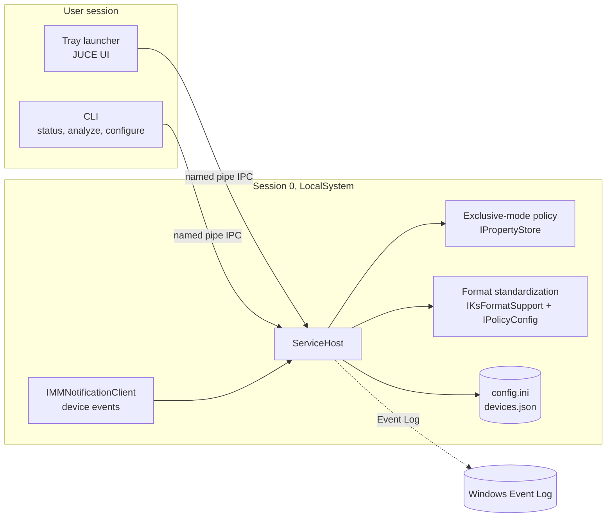

<!--
  Cards are rendered by scripts/generate.mjs and published to the `output`
  branch by .github/workflows/profile.yml. Edit scripts/profile.config.mjs to
  change the static content; numbers refresh automatically every day.
-->

<picture>
  <source media="(prefers-color-scheme: dark)" srcset="https://raw.githubusercontent.com/caio-kenai/caio-kenai/output/header-dark.svg">
  
</picture>

<p align="center">
  <a href="https://kenai.site"></a>
  <a href="https://www.linkedin.com/in/caio-oliveira-pacifico-a6042b246"></a>
  <a href="mailto:caiokenai10@gmail.com"></a>
  
</p>

## About

I build software that has to keep running: Windows services that sit next to live broadcast audio, offline-first mobile apps, and the backends and automation around them. I care about the boring parts that make things reliable, such as clean installers, predictable upgrades, logs you can actually read, and interfaces that respect the user.

- Developer at **Playlist Software Solutions**, working across desktop, mobile, backend and AI-assisted tooling
- Low-level Windows work in **C++20**: Core Audio, WASAPI, Win32 services, named-pipe IPC, JUCE
- Product work in **TypeScript**: React, Next.js, React Native with Expo, Node.js
- Comfortable with **Rust, Go, C# and Python** when the problem calls for it
- My main projects are open source under **AGPL-3.0**

<details>
<summary><b>caio.config.ts</b></summary>

```ts
export const caio = {
  location: 'Ipatinga, MG, Brazil',
  focus: ['Windows audio tooling', 'offline-first apps', 'automation'],
  principles: [
    'the local copy is the source of truth',
    'money is integer cents, never floats',
    'no telemetry the user did not ask for',
    'one commit per change, readable history',
  ],
  offHours: 'metalcore',
} as const;
```

</details>

## Tech stack

| Area | Tools |
| :-- | :-- |
| **Languages** |  |
| **Frontend** |  |
| **Mobile and desktop** |     |
| **Backend** |  |
| **Data** |    |
| **Infra and tooling** |   |

## Featured projects

<p align="center">
  <a href="https://github.com/caio-kenai/Audioslave"><picture>
    <source media="(prefers-color-scheme: dark)" srcset="https://raw.githubusercontent.com/caio-kenai/caio-kenai/output/project-audioslave-dark.svg">
    
  </picture></a>
  <a href="https://github.com/caio-kenai/Audio-Watchdog"><picture>
    <source media="(prefers-color-scheme: dark)" srcset="https://raw.githubusercontent.com/caio-kenai/caio-kenai/output/project-audio-watchdog-dark.svg">
    
  </picture></a>
  <a href="https://github.com/caio-kenai/Troqito"><picture>
    <source media="(prefers-color-scheme: dark)" srcset="https://raw.githubusercontent.com/caio-kenai/caio-kenai/output/project-troqito-dark.svg">
    
  </picture></a>
  <a href="https://github.com/caio-kenai/Portfolio"><picture>
    <source media="(prefers-color-scheme: dark)" srcset="https://raw.githubusercontent.com/caio-kenai/caio-kenai/output/project-portfolio-dark.svg">
    
  </picture></a>
</p>

<details>
<summary><b>Audioslave: how it works</b></summary>
<br>

One executable, three roles: started with no arguments it is the tray launcher, with `--service` it is the Windows service, and with a verb it is the CLI. The service runs as LocalSystem in session 0 and owns every privileged operation; the tray and the CLI talk to it through a named pipe, so a regular user can inspect and control it without elevation.



- **Exclusive mode off, always.** Endpoint property stores are rewritten whenever Core Audio reports a new or changed device.
- **Real format probing.** With exclusive mode blocked, `IsFormatSupported(EXCLUSIVE)` is useless, so supported formats are read through `IKsFormatSupport` on the kernel-streaming topology, and the mix format is applied with `IPolicyConfig`.
- **Incompatible device policy.** Devices that cannot run the standard format can be disabled and are tracked, with a loop guard and an explicit "re-enable and keep" exemption.
- **Shipping details.** Custom installer and uninstaller, portable mode, per-DPI tray icons, dark JUCE-drawn dialogs, unit tests and a scripted Ninja build.

</details>

<details>
<summary><b>Troqito: architecture notes</b></summary>
<br>

- **Offline-first for real.** `expo-sqlite` with Drizzle is the source of truth, not a cache; Supabase sync runs when there is a network.
- **Correct money.** Every amount is an integer number of cents, and installment and split math distributes the remainder so the parts always add up to the total.
- **Shared houses.** Postgres row-level security with `SECURITY DEFINER` helpers avoids recursive membership policies.
- **Own charts.** Accessible charts drawn with `react-native-svg` instead of a charting dependency.
- **Stack.** Expo SDK with prebuild and local Gradle builds, React Native, expo-router, strict TypeScript.

</details>

<details>
<summary><b>More repositories</b></summary>
<br>

| Project | What it is | Stack |
| :-- | :-- | :-- |
| [Estoqito](https://github.com/caio-kenai/Estoqito) | Open source mobile app for inventory management, early stage | Mobile |
| [agente_rag-com-next-e-flask](https://github.com/caio-kenai/agente_rag-com-next-e-flask) | RAG assistant over PDF documents with ChromaDB and Gemini | Next.js, Flask, LangChain |
| [landing-page-responsiva-com-tailwindcss](https://github.com/caio-kenai/landing-page-responsiva-com-tailwindcss) | Responsive landing page | HTML, Tailwind CSS |

</details>

## GitHub activity

<p align="center">
  <picture>
    <source media="(prefers-color-scheme: dark)" srcset="https://raw.githubusercontent.com/caio-kenai/caio-kenai/output/stats-dark.svg">
    
  </picture>
  <picture>
    <source media="(prefers-color-scheme: dark)" srcset="https://raw.githubusercontent.com/caio-kenai/caio-kenai/output/languages-dark.svg">
    
  </picture>
</p>

<p align="center">
  <picture>
    <source media="(prefers-color-scheme: dark)" srcset="https://raw.githubusercontent.com/caio-kenai/caio-kenai/output/activity-dark.svg">
    
  </picture>
</p>

<p align="center">
  <picture>
    <source media="(prefers-color-scheme: dark)" srcset="https://raw.githubusercontent.com/caio-kenai/caio-kenai/output/snake-dark.svg">
    
  </picture>
</p>

<details>
<summary><b>How this profile is built</b></summary>
<br>

Every card above is a hand-written SVG generated by [`scripts/generate.mjs`](scripts/generate.mjs), a dependency-free Node.js script. A scheduled workflow queries the GitHub GraphQL API once a day, renders a dark and a light variant of each card, draws the contribution snake with [Platane/snk](https://github.com/Platane/snk) and publishes the result to the `output` branch. The README picks the right variant with `<picture>` and `prefers-color-scheme`.

Animations are plain CSS keyframes and SMIL, because images embedded in a README never run JavaScript. They are disabled automatically for visitors who prefer reduced motion.

```sh
GITHUB_TOKEN=$(gh auth token) npm run generate   # writes dist/*.svg and dist/preview.html
```

</details>

<picture>
  <source media="(prefers-color-scheme: dark)" srcset="https://raw.githubusercontent.com/caio-kenai/caio-kenai/output/footer-dark.svg">
  
</picture>
